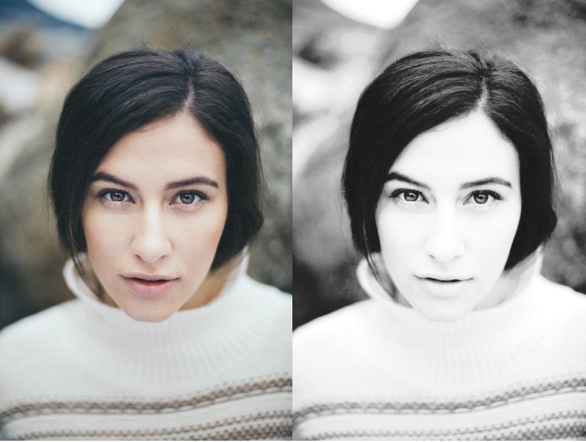

# Halftone filter p5.js

Halftone effect made with p5.js (Processing).



# Setup

1. Install the server.

```bash
npm install -g http-server
```

2. Run the server.

```bash
http-server
```

3. In your browser open the page:
```
http://localhost:8080/
```

## How to use it with your image

Change in sketch.js(line 8) the image path to yours:
```js
originalImage = loadImage("YOURPATH");
```


## Photo Credits
1. Woman photo: Photo by Lindie Wilton on Unsplash
2. Feather photo: Photo by James & Carol Lee on Unsplash

## Resources

1. Lines per Inch(http://facweb.cs.depaul.edu/sgrais/color_line_screen.htm)

